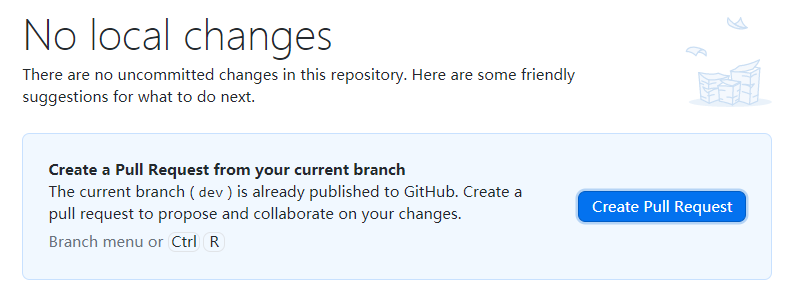
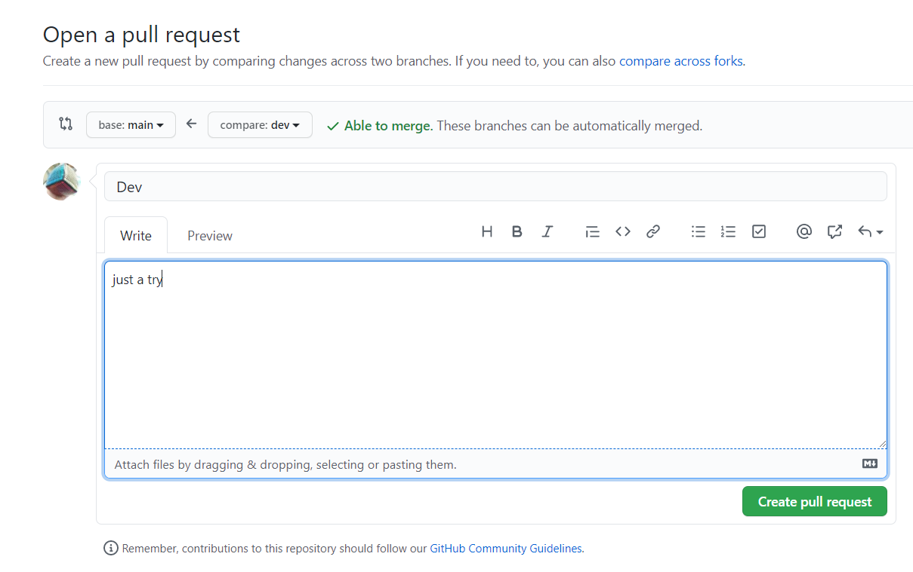

# git分支管理

### 建立分支

这里可以查看总体分支的数量以及状态

这里可以使用git desktop来建立新的分支

### 分支管理

完成分支建立后切换到相应分支进行文件提交后可以push到我们当前分支去

### 合并分支

成功提交到我们的远程分支仓库后就可以准备合并分支，将提交的内容归并到主分支中了

根据打开的网页进行分支归并，也可以查看要归并的分支做了哪些修改

### 删除分支
